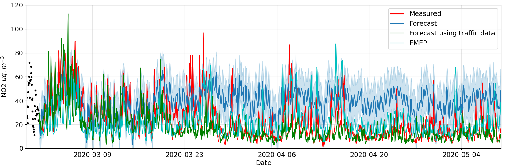

# Prophet_forecasting_AQ
Using and evaluating Facebooks's Prophet model for forecasting

  
  

This repository contains scripts that deploy Facebook's [Prophet](https://facebook.github.io/prophet/docs/quick_start.html) time series forecasting model to predict Air Quality at a number of sites. Originally focused on the UK [Automatic Urban and Rural Network (AURN) network](https://uk-air.defra.gov.uk/networks/network-info?view=aurn), there are options to fit and evaluate the 'vanilla' model across all sites within dates defined by the user. In addition, there are model variants designed to use traffic volume as an additional regressor, as described briefly below.

For those wishing to download the AURN data and perform statistical analysis seperate to scripts provided here, you can find those scripts in my other [Github repository](https://github.com/loftytopping/DEFRA_Air_Quality_data).

This project is licensed under the terms of the GNU General Public License v3.0, as provided with this repository. 

# Table of contents
1. [Rationale](#Model-overview)
2. [Dependencies and installation](#Dependencies)
3. [Folder structure](#Folder-Structure)
4. [Contributing](#Contributing)
5. [Code of Conduct](#Code-of-Conduct)

## Model overview

## Dependencies and installation 

The current scripts were developed in the Anaconda Python 3.8 environment. Installing the Prophet model was not as straight forward as I would have hoped, where multiple dependencies had to be manually configured through the Pip package manager. I have provided the .yml environment file in this repository for those wishing to replicate my environment. This currently is provided under a Windows10 setting.

## Folder structure 

    .                           # Model using only AQ data and met data [first provided with AURN output]
    ├── images                  # Example images
    ├── Traffic_Data            # Compilation of traffic data and scripts to use this data as additional regressors
    |.. --EMEP_data             # Output from the regional model EMEP, for years 2018-2019 and March-June 2020 for the COVID19 lockdown
    |.. --TfGM                  # Transport data for two sites in Manchester, provided by Transport for Greater manchester
    ├── LICENSE
    └── README.md
   
The current home directory includes scripts to deploy and evaluate Prophet across either the entire AURN network, or focus on sites held wihin specific local authorities. In the python file

- automated_prophet_all_site_analyses.py
    
You can change the options according to your needs. This file uses the vanilla version of Prophet and deploys the provided cross-validation method for evaluating performance. Absolute errors and actual forecasts are saved, by default, as .csv files. Please note in this file you need to specify the location of any AURN data to be downloaded/retrieved and also where the output from the Prophet validation should be saved. In the Python file

- All_site_statistics_prophet.py
 
we provide methods for generating statistical analysis of all site data saved within the same locations, as a function of AURN site type. In the Python file

- automated_prophet_detailed_site_analysis.py

we provide templates for evaluating different approaches of using prophet at individual sites. These include using different historical intervals for model fitting and changing the weight of changepoints detected in the fitting process etc. Again please change the data locations according to your needs.

In the Traffic_Data folder I have seperated the traffic volume data provided by local transport authorities, and the use of said data in fitting the Prophet model. In the current instance, this includes fitting the model to predict inferred pollutant/traffic volume and then using the same traffic volume data to predict actual concentrations of pollutants. This is because adding traffic data, directly, as an additional regressor to the vanilla model does not improve performance. This is because any traffic apportionment to the measured pollutant signal is already captured in the seasonality displayed in the data. For example, in the Python file

- Single_site_combined_Piccadilly.py

I import the traffic data relevant to the AURN site in Manchester Piccadilly and then create a merged dataframe to perform Prophet model fitting. I also include output from the regional model EMEP, supported by Research IT at Manchester University. Operational scripts for setup of EMEP are available from https://github.com/UoMResearchIT/BB\_EMEP\_Ops.git; and inputs and configuration files are available from https://www.dropbox.com/s/iuoy64zpei3f43i/Britain\_Breathing\_Operational\_Inputs.tar.gz.

## Contributing

Contributions to these scripts are more than welcome. There are many developments planned for building on the use of Prophet and other models. I am therefore very happy to discuss ideas for improvement and how to add/remove features.  Please use the issue tracker if you want to notify me of an issue or need support. If you want to contribute, please either create an issue or make a pull request. Alternatively, come and see us in Manchester and/or lets meet for a coffee and a chat!

## Code of Conduct

Please note that this project is released with a Contributor Code of Conduct. By participating in this project you agree to abide by its [terms](code-of-conduct.md). 
