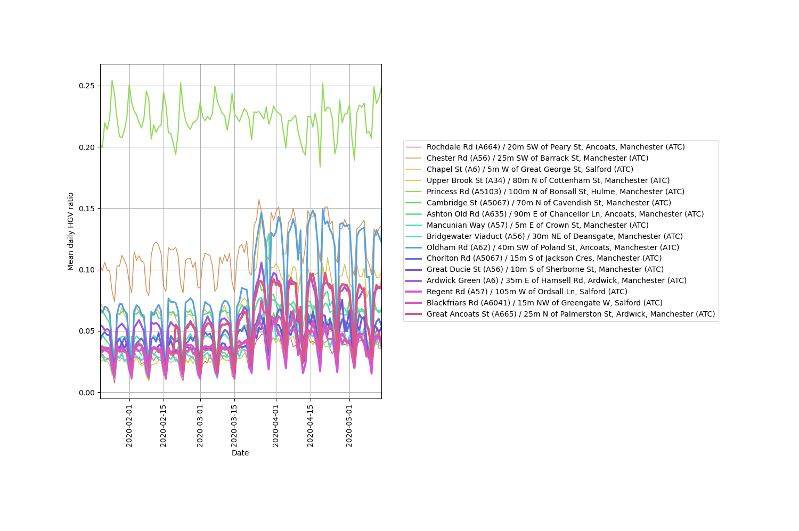
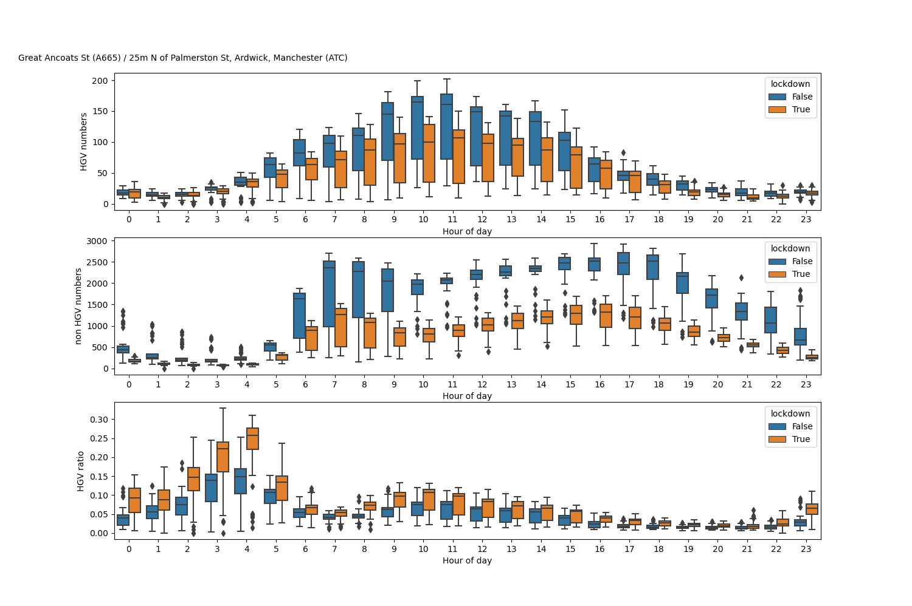

Traffic data for this study is provided by Transport for Greater Manchester, the local government body responsible for delivering Greater Manchester’s transport strategy and commitments (https://tfgm.com/about-tfgm). Through use of their cloud-hosted data platform, C2 (https://www.drakewell.com/), data from their estate of Intelligent Transport Systems (ITS) could be readily accessed.

 
Included in this estate, are a network of Automatic Traffic Count (ATC) sites, monitoring vehicles using Induction Loop Detectors (ILDs) in the carriageway, which provides vehicle flow, speed and classification data in real-time to the platform. Approximately 120 sites constitute for this network of ATC sites, strategically located across main routes and the Key Route Network (KRN). The .csv file on ATC sites lists the name and metadata associated with each site.

Also included as part of TfGM’s ITS estate, are a network of approximately 550 Bluetooth Journey Time Passive Sensors, primarily located at Traffic Signal junctions along major routes across the wider Greater Manchester (GM) region. Sensors use an external antenna to capture Bluetooth enabled devices, storing their unique Media Access Control (MAC) address, which is then randomised and encrypted. MAC addresses are collected across the network with an associated timestamp, allowing journey times to be generated across the Highway Network, utilising the C2 platform to filter outliers. A validation exercise completed internally at TfGM estimates that this method captures between 8% – 15% of vehicles making a journey between two sensors, depending on the route. The .csv file on these sites lists the name and metadata associated with each site.

ATC Manufacturer: https://www.q-free.com/product/hi-trac-emu3/

Bluetooth Journey Time Passive Sensor: https://www.q-free.com/product/hi-trac-blue2/

Key Route Network: https://images.ctfassets.net/nv7y93idf4jq/3BvLFImGfKgQmRLolOHZ3e/06fb54c856bef6393b15fa48c0a77424/KRN_map.png”

The python script 'Centre_multisite_traffic_type.py' procides an example of analysing multisite data from Manchester within a specific period, focusing on the COVID19 lockdown. The script also generates plots on changes in vehicle types at specific sites between two periods, such as can be seen in the following images.
 

  
  

